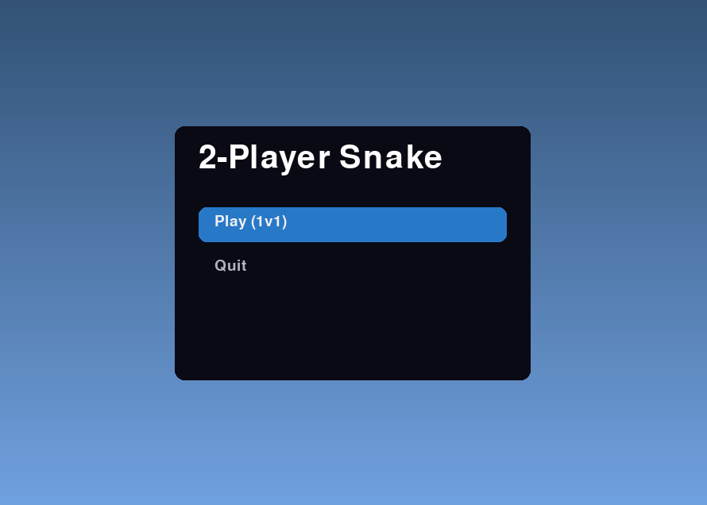
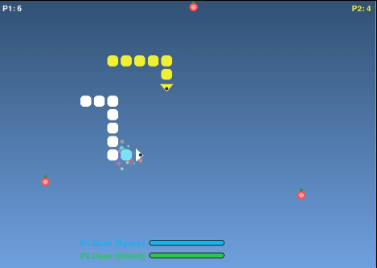

# 🎮 ABS Snake Duo – 2-Player Python Snake Game (Pygame)


ABS Snake Duo is a fast, competitive **2-player Snake Game** built in **Python + Pygame**.  
It features dashing, particle effects, smooth movement, a clean UI, and polished gameplay perfect for beginners, students, and game developers.

---

## 🚀 Features

- 🐍 **Local 2-player multiplayer**
- ⚡ Dash ability with energy bars
- 🍎 Dynamic food spawning (3–6 apples)
- ✨ Particle effects on food collection
- 🎨 Gradient glass background
- 🏆 Scoreboard + Game Over screen
- 🎛️ Main menu with navigation
- 🔄 Restart system
- 📦 Fully commented and clean code

---

## 📦 Installation

### 1. Install Python  
Download Python 3.9+ here:  
https://www.python.org/downloads/

### 2. Install Pygame  
```bash
pip install pygame
```

### 3. Run the game  
```bash
python Snake.py
```

---

## 🎮 Controls

### **Player 1 (Left Snake)**
| Action | Key |
|-------|-----|
| Move Up | W |
| Move Down | S |
| Move Left | A |
| Move Right | D |
| Dash | SPACE |

### **Player 2 (Right Snake)**
| Action | Key |
|--------|-----|
| Move Up | ↑ |
| Move Down | ↓ |
| Move Left | ← |
| Move Right | → |
| Dash | Right Shift |

---

## 🖼️ Screenshots  
(Place your images inside `/screenshots` folder)

### Menu  


### Gameplay  


### Game Over  


---

## 📁 Project Structure

```
ABS-Snake-Duo/
│── Snake.py
│── requirements.txt
│── README.md
│── LICENSE
└── screenshots/
```

---

## 📝 License  
This project is licensed under the **MIT License**.  
See the LICENSE file for details.

---

## ⭐ Contribute  
Pull requests and improvements are welcome!

---

## 📢 Credits  
Created by ABS — https://www.youtube.com/@DevelopmentWithABS
